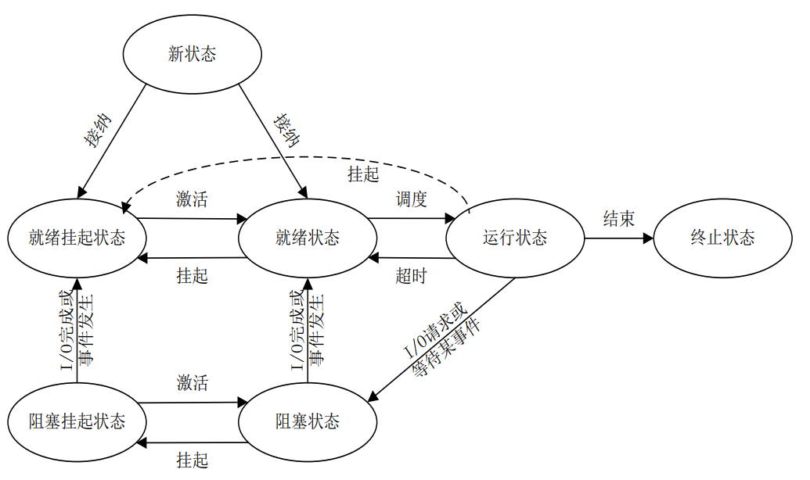
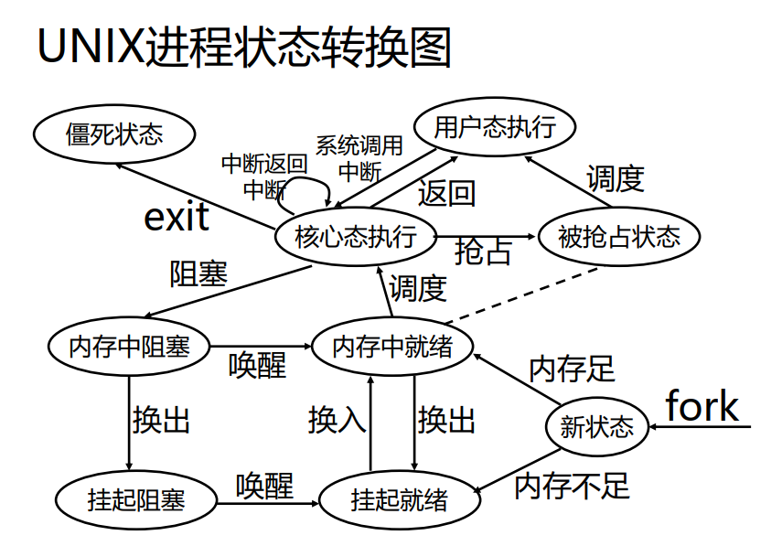
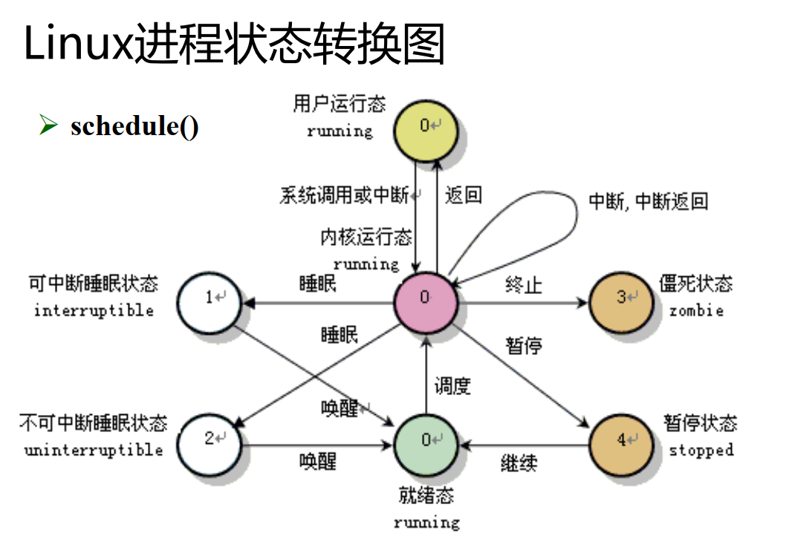

# 操作系统进程管理

## 1、为什么引入进程的概念

为了实现多个程序并发执行的可再现性，引入进程的概念。进程是对资源分配和调度的独立单位。

进程由程序段、数据段、进程控制块（process control block,PCB）三部分组成。

## 2、进程状态及状态转换图

进程有就绪、运行、阻塞三个基本状态，为了更加准确地描述进程的调度过程，又引入新状态、终止状态、挂起状态。

进程的基本状态转换图如下：

+ 在内存充足情况下，作业由外存调入内存，进入就绪状态；内存不足则进入就绪挂起状态。

+ 当CPU根据调度算法调度进程时，进程由就绪状态转换为执行状态，如果是分时操作系统，有可能因为超时使进程由运行态转换为就绪态。当由于外部因素让正在运行的进程停止运行时，进程由运行状态转换为挂起态。被激活后进入就绪队列。运行进程正常结束则进入终止状态，被终止的进程会复制PCB到指定域，以防需要查看进程执行结果。

+ 当正在执行的进程需要I/O请求或者等待某一事件发生，则由运行态转换为阻塞状态，提高处理器利用率。当I/O完成或者事件发生时，被阻塞的进程进入就绪态。如果进程被阻塞的过程中，出现内存不足的情况，被阻塞的进程会进入挂起状态。

UNIX进程状态转换图：

+ 值得注意的是，UINX的执行态分为用户态执行和内核态执行，当用户态发生中断或系统调用时会转到内核态。并且有可能被抢占。终止状态在这里是僵死状态。

+ linux进程状态中没有了阻塞状态和挂起状态，取而代之的是睡眠状态和暂停状态。

## 3、进程控制块

描述进程情况和控制进程运行的记录型数据结构。PCB中记录的信息有进程标识符、进程控制信息、进程调度信息和处理器状态等。

存放于内存中的内核区专门开辟的PCB区。采用链接或索引的组织方式，区分空闲PCB、就绪PCB、阻塞PCB、执行PCB等。

## 4、进程的创建与终止

引起进程创建事件：
    
+ 用户登录

+ 作业调度

+ 提供服务

+ 应用请求

进程创建过程（create原语）：

+ 分配标识符并申请空白PCB；

+ 为新进程的程序、数据及用户栈分配内存空间；

+ 初始化进程控制块；

+ 将新进程插入就绪队列。

引起进程终止的事件：

+ 正常结束

+ 发生异常

+ 外界干扰

终止进程过程（terminate原语）：

+ 检索PCB，查看进程状态；

+ 若进程处于执行状态，立即终止执行并设置调度标志为真，以指示可以调度其他进程；

+ 终止子孙进程；

+ 资源回收；

+ 移出被终止的PCB，等待其它程序查询利用。

## 5、进程同步

临界资源：一段时间内只允许一个进程访问的资源称为临界资源。

临界区:进程中访问临界资源的那段代码叫做临界区。

要想保证只有一个程序进入临界资源，可以通过让进程互斥地进入各自临界区。

进程同步机制基本准则：

+ 空闲让进，当无进程处于临界区时，可允许一个请求进程进入临界区；

+ 忙则等待，已有进程进入临界区时，其他企图进入临界区的进程必须等待；

+ 有限等待，进程在有限时间内可以进入临界区；

+ 让权等待，当自己不能进入临界区时，应当释放资源，让其他进程进入。

进程互斥访问临界资源的4种软件解决方法都不能完全满足同步机制的基本准则，而且需要程序设计者自己设计，很容易出错。

硬件解决方法Test-and-Set指令和Swap指令，仍然违反让权等待的原则。

引入信号量机制：

+ 整型信号量机制，没有可用资源的时候空操作，仍然违反让权等待原则；

+ 记录型信号量机制，通过调用阻塞原语解决让权等待的问题。但是当多个进程共享两个或两个以上临界资源时，有可能造成死锁。

+ AND型信号量，资源同时申请同时释放，避免可能造成的死锁问题。

+ 一般信号量集机制，以上信号量每次只能申请/释放一个资源，比较低效，而且实际情况可能存在资源个数低于某个下限值不予分配的情况，可以通过一般型信号量解决。

信号量解决的经典同步问题：

- 生产者-消费者问题

- 哲学家就餐问题

- 写者-读者问题

基于信号量的同步机制，各进程需自备同步操作，大量同步操作的分散不利于系统管理，还有可能造成死锁。引入管程管理并发进程间的同步操作。

管程每次只允许一个进程进入以保证互斥

